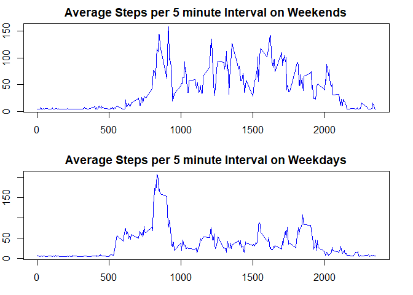

#**REPRODUCIBLE RESEARCH:Coursera Assignment**
#Personal movement Analysis using activity monitoring devices
###*By Varishu Pant*
###*30-06-2018*

##Loading Required Packages


```r
library(knitr)
library(dplyr)
```

```
## 
## Attaching package: 'dplyr'
```

```
## The following objects are masked from 'package:stats':
## 
##     filter, lag
```

```
## The following objects are masked from 'package:base':
## 
##     intersect, setdiff, setequal, union
```


##Setting Global Options

I set global options such that echo=TRUE all throughout the file

```r
opts_chunk$set(echo=TRUE)
```

##Setting Working Directory

This is the code for setting my working directory


```r
setwd("C:/Users/acer/Desktop/R Stuff")
```

##Reading Data

I use read.csv() to read the required data

```r
Data<-read.csv("activity.csv",header = TRUE)
```

##Finding mean total number of steps taken per day

I group the data by date,and summarise it to make a new dataset.Then I add appropriate names to the new data set and plot a histogram of total steps taken per day.


```r
grouped_data<-group_by(Data,date)
newData<-summarise(grouped_data,Steps_per_Day<-sum(steps,na.rm = TRUE))
names(newData)<-c("Days","Steps_Taken")
hist(newData$Steps_Taken,xlab="Total Steps
Taken",col="blue",main="Total Steps Per Day")
```

<!-- -->
I find mean and median of total number of steps taken per day
 

```r
Mean<-mean(newData$Steps_Taken)
Median<-median(newData$Steps_Taken)
paste("Mean of Total Number of Steps Taken Per Day is equal to" ,Mean)
```

```
## [1] "Mean of Total Number of Steps Taken Per Day is equal to 9354.22950819672"
```

```r
paste("Median of Total Number of Steps Taken Per Day is equal to",Median)
```

```
## [1] "Median of Total Number of Steps Taken Per Day is equal to 10395"
```

##Finding Average Daily Activity Pattern


I group Data by interval,and summarise it to make a new dataset.Then I make a time series plot of average number of steps taken per interval.


```r
grouped_data2<-group_by(Data,interval)
 newData2<-summarise(grouped_data2,Average_Steps_per_Interval=mean(steps,na.rm=TRUE))
 plot(newData2,type="l",col="blue",ylab="Average Steps",xlab="Intervals",main="Average Steps per 5 minute Interval")
```

<!-- -->

Now to find for which interval are the average steps maximum-


```r
max<-which.max(newData2$Average_Steps_per_Interval)
reqInterval<-newData2$interval[max]
paste("The interval number",reqInterval,"on average across all the days in the dataset, contains the maximum number of steps.")
```

```
## [1] "The interval number 835 on average across all the days in the dataset, contains the maximum number of steps."
```

##Imputing Missing Values

I find the total number of missing values in the dataset


```r
TotalNAs<-sum(is.na(Data))
TotalNAs
```

```
## [1] 2304
```

I choose to replace all NAs in steps with the mean of the column.The new dataset is called Data2


```r
Data2<-Data
Data2$steps[is.na(Data2$steps)]<-mean(Data2$steps,na.rm=TRUE)
```

I plot the histogram of the total number of steps taken each day, calculate and report the mean and median of total number of steps taken per day.


```r
grouped_data3<-group_by(Data2,date)
newData3<-summarise(grouped_data3,Steps_per_Day<-sum(steps,na.rm = TRUE))
names(newData3)<-c("Days","Steps_Taken")
hist(newData3$Steps_Taken,xlab="Total Steps
Taken",col="blue",main="Total Steps Per Day without NAs")
```

<!-- -->
 

```r
Mean2<-mean(newData3$Steps_Taken)
Median2<-median(newData3$Steps_Taken)
paste("Mean of Total Number of Steps Taken Per Day is equal to" ,Mean2)
```

```
## [1] "Mean of Total Number of Steps Taken Per Day is equal to 10766.1886792453"
```

```r
paste("Median of Total Number of Steps Taken Per Day is equal to",Median2)
```

```
## [1] "Median of Total Number of Steps Taken Per Day is equal to 10766.1886792453"
```

```r
paste("The values of mean is equal to that of median and are both different than the mean and median values before imputation of missing values .")
```

```
## [1] "The values of mean is equal to that of median and are both different than the mean and median values before imputation of missing values ."
```

##Finding out if there are differences in activity patterns between weekdays and weekends

I create a new factor variable in the dataset with two levels - "weekday" and "weekend" indicating whether a given date is a weekday or weekend day


```r
Data2$date<-as.Date(Data2$date)
Data2<- mutate(Data2, day = ifelse(weekdays(Data2$date) == "Saturday" | weekdays(Data2$date) == "Sunday", "weekend", "weekday"))
Data2$day<-as.factor(Data2$day)

weekend<-subset(Data2,Data2$day=="weekend")
weekdays<-subset(Data2,Data2$day=="weekday")
```

I create a panel plot containing a time series plot of the 5-minute interval and the average number of steps taken, averaged across all weekday days or weekend days.


```r
par(mfrow=c(2,1),mar=c(3,2,2,2))

grouped_weekend<-group_by(weekend,interval)
WeekendData<-summarise(grouped_weekend,Average_Steps_per_Interval=mean(steps,na.rm=TRUE))
plot(WeekendData,type="l",col="blue",ylab="Average Steps",xlab="Intervals",main="Average Steps per 5 minute Interval on Weekends")

grouped_weekday<-group_by(weekdays,interval)
WeekdayData<-summarise(grouped_weekday,Average_Steps_per_Interval=mean(steps,na.rm=TRUE))
plot(WeekdayData,type="l",col="blue",ylab="Average Steps",xlab="Intervals",main="Average Steps per 5 minute Interval on Weekdays")
```

<!-- -->

###Average number of steps during weekends show higher values than that in the weekdays

